# 📚 Booklog

> 독서를 기록하고, 공유하며, 그 가치를 확장하는 플랫폼

[](https://react.dev/)
[](https://vitejs.dev/)
[](https://firebase.google.com/)
[](https://tailwindcss.com/)
[](https://www.docker.com/)

개발 기간: 2026.04.20 ~ 2026.05.06 · 배포 URL: `https://booklog.kro.kr`

---

## 목차

1. [프로젝트 소개](#-프로젝트-소개)
2. [주요 기능](#-주요-기능)
3. [화면 구성](#-화면-구성)
4. [기술 스택](#-기술-스택)
5. [폴더 구조](#-폴더-구조)
6. [실행 방법](#-실행-방법)
7. [테스트 계정](#-테스트-계정)
8. [환경 변수 설정](#-환경-변수-설정)
9. [배포 구조 / CI-CD](#-배포-구조--cicd)
10. [팀원 및 역할](#-팀원-및-역할)
11. [협업 방식](#-협업-방식)
12. [트러블슈팅](#-트러블슈팅)
13. [개발 참고사항](#-개발-참고사항)

---

## 📖 프로젝트 소개

**Booklog(북로그)**는 흩어진 독서 경험을 한 곳에 기록하고 축적하기 위한 독서 기록 플랫폼입니다. 읽고 싶은 책부터 완독한 책까지 한눈에 관리하며, 독서 습관을 데이터로 쌓아가는 것을 목표로 합니다.

단순한 기록을 넘어, 독서 모임과 게시판을 통해 다른 독자들과 경험을 나누고, 독서 활동으로 적립한 포인트를 기부로 연계해 독서의 가치를 사회적으로 확장하는 데 중점을 두었습니다.

알라딘 Open API 기반 도서 검색, Firebase 인증/데이터베이스, AI 챗봇과 날씨 기반 추천까지 결합해 개인화된 독서 경험을 제공하는 웹 서비스입니다.

---

## ✨ 주요 기능

| 기능 | 설명 |
|---|---|
| 🔐 인증/온보딩 | Firebase Authentication 기반 회원가입·로그인, 최초 로그인 시 닉네임/관심 장르 온보딩 |
| 🔍 도서 검색 | 알라딘 Open API 연동 검색, 인기 장르별 베스트셀러/신간 탐색 |
| 📘 도서 상세 | 도서 정보·미리보기, 주변 도서관 소장 여부 및 위치 지도 안내 |
| 📚 서재 | 읽고 싶음/읽는 중/완독 상태 관리, 페이지 진행률, 독서 로그·메모·별점 |
| 📅 독서 캘린더 | 날짜별 독서 체크, 연속 독서(streak) 시각화 |
| 👥 커뮤니티 | 독서 모임 개설/참여/댓글, 자유 게시판(독후감/자유/질문/추천) |
| 🎁 포인트 & 기부 | 독서 체크/메모/게시글 작성 시 포인트 적립, 기부 캠페인 연계, 레벨 시스템 |
| 🤖 AI 챗봇 | Groq(LLaMA 3.3 70B) 기반 독서 추천/대화 챗봇 |
| ⛅ 날씨 기반 추천 | 현재 날씨에 맞는 분위기의 도서 추천 |
| 🎨 테마 | 다중 테마 및 시즌(계절) 이펙트 |

---

## 🖼 화면 구성

<table>
<tr>
<td align="center">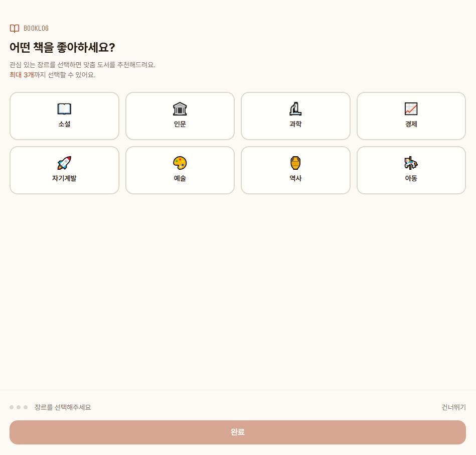<br/>온보딩</td>
<td align="center">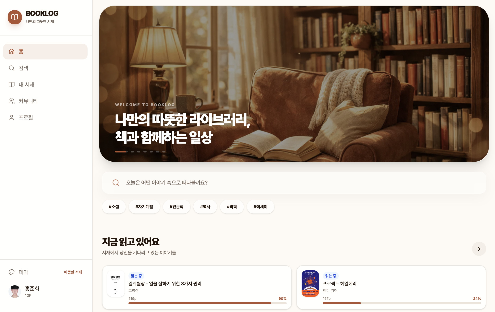<br/>메인(홈)</td>
<td align="center">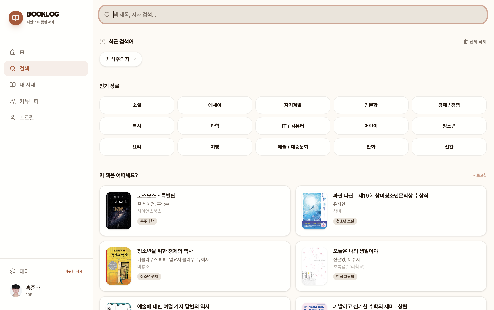<br/>도서 검색</td>
</tr>
<tr>
<td align="center">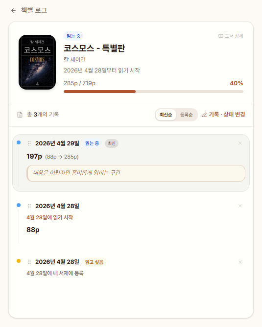<br/>내 서재</td>
<td align="center">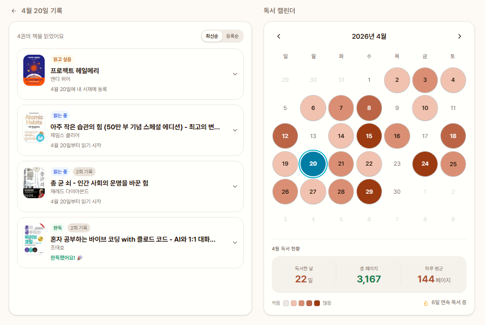<br/>독서 캘린더</td>
<td align="center">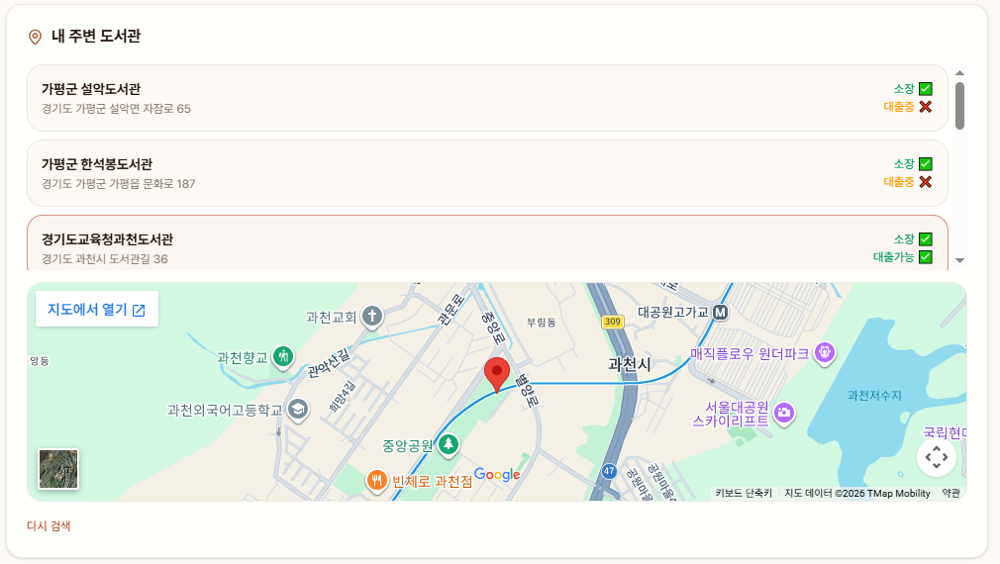<br/>도서관 지도</td>
</tr>
<tr>
<td align="center">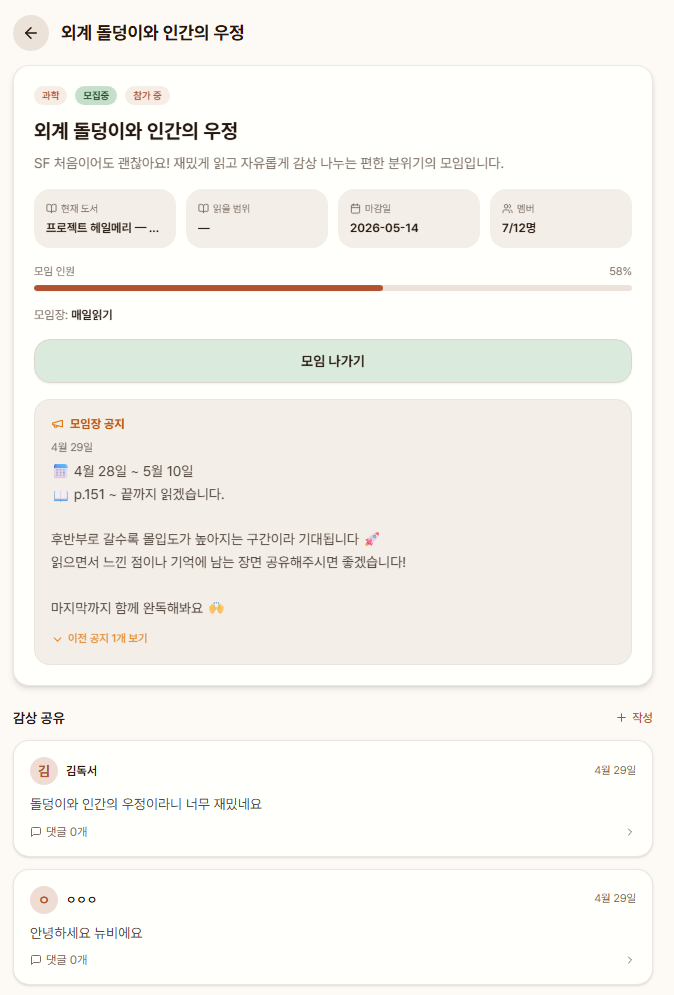<br/>독서 모임</td>
<td align="center">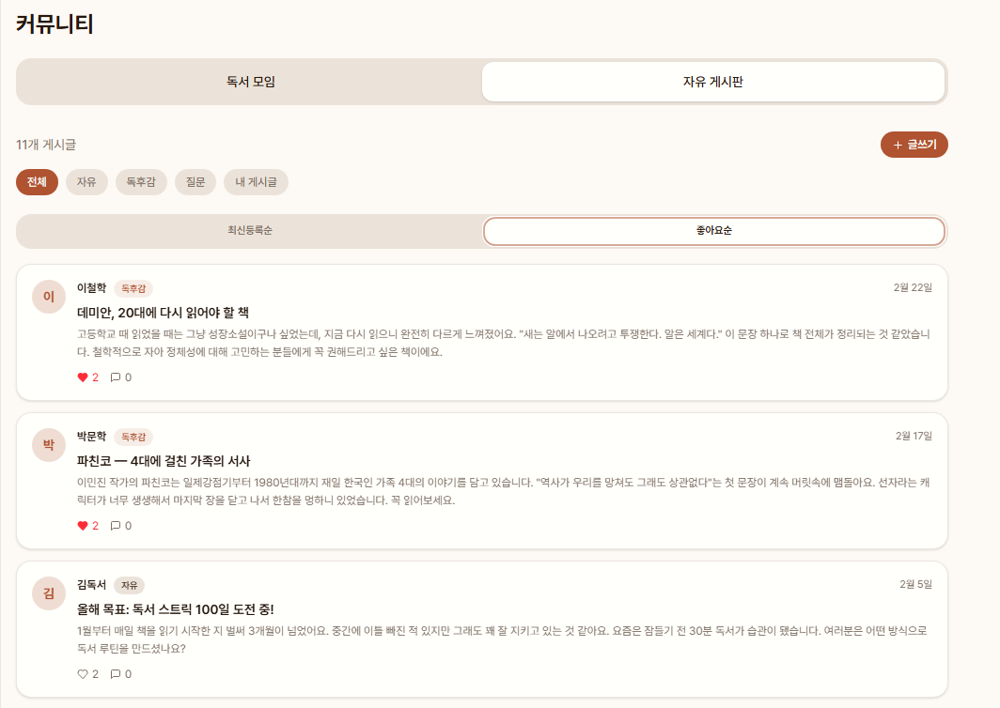<br/>자유 게시판</td>
<td align="center">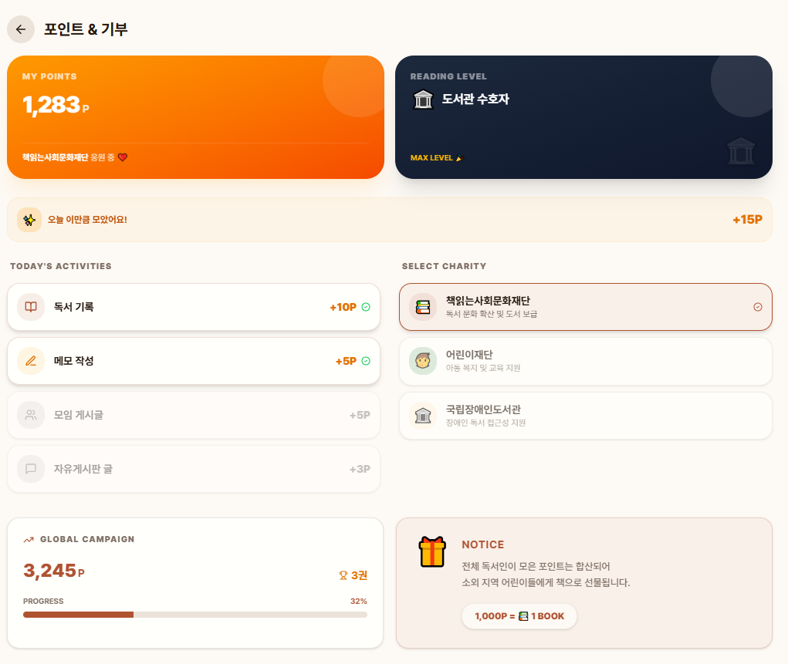<br/>포인트/기부</td>
</tr>
<tr>
<td align="center">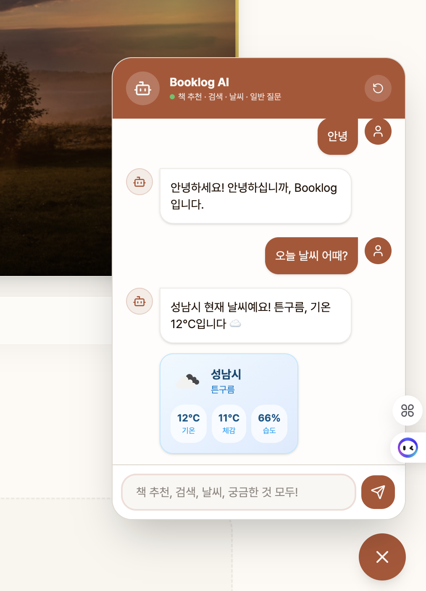<br/>AI 챗봇</td>
<td align="center">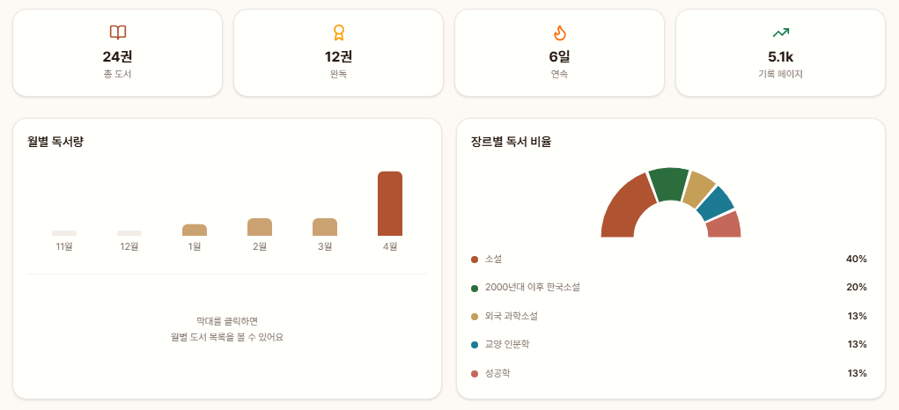<br/>프로필</td>
<td align="center">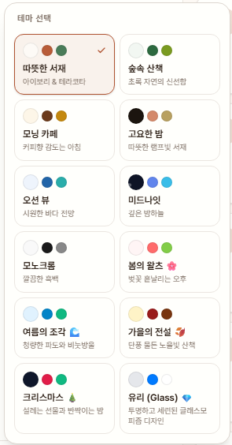<br/>테마</td>
</tr>
</table>

> 전체 화면 캡처는 [`client/public/features/`](client/public/features), 데모 영상은 [`client/public/videos/demo.mp4`](client/public/videos/demo.mp4) 에서 확인할 수 있습니다.

---

## 🛠 기술 스택

| 구분 | 기술 |
|---|---|
| Frontend | React 19 + Vite 6, React Router DOM v7 |
| 상태 관리 | Context API (Auth / Shelf / Point / Theme / Weather) |
| 스타일 | Tailwind CSS 4, Radix UI 기반 컴포넌트, Framer Motion |
| 인증/DB | Firebase Authentication + Firestore + Storage |
| 서버 | Node.js (Express) — 외부 API 프록시 + SPA 정적 서빙 |
| 외부 API | 알라딘(Aladin) Open API · Groq API · Google Maps API · 도서관 정보나루 API · OpenWeather API |
| 인프라/배포 | Docker, AWS EC2, GitHub Actions(CI/CD) |

---

## 📂 폴더 구조

```
Booklog/
├── client/
│   ├── index.html
│   ├── public/
│   │   ├── features/        # 기능별 스크린샷
│   │   └── videos/demo.mp4   # 시연 영상
│   └── src/
│       ├── firebase/          # Firebase 초기화 (config.js)
│       ├── contexts/          # Auth / Shelf / Point / Theme / Weather Context
│       ├── pages/              # Auth, Home, Search, BookDetail, Library, Profile, Community, Board, Meeting, Points 등
│       ├── components/         # SideNav, BookCard, ShelfCard, ChatBot, ReadingTracker 등 + ui/
│       ├── hooks/
│       └── utils/               # api.js(알라딘 연동), community.js, groqQueue.js 등
├── server.js                 # Express 서버 (API 프록시 + 빌드된 SPA 서빙)
├── scripts/seedFirestore.cjs # Firestore 시드 스크립트
├── Dockerfile
├── .github/workflows/deploy.yml  # develop 브랜치 push 시 EC2 자동 배포
├── vite.config.js             # envDir을 프로젝트 루트로 지정 (.env 위치 기준)
└── package.json
```

---

## 🚀 실행 방법

```bash
git clone https://github.com/Booklog-Team/Booklog.git
cd Booklog
npm install
```

`vite.config.js`에서 `envDir`이 프로젝트 루트로 지정되어 있으므로, **프로젝트 루트**에 `.env` 파일을 생성하고 [환경 변수 설정](#-환경-변수-설정)에 명시된 값을 입력합니다.

```bash
npm run dev          # http://localhost:3000 (Vite 개발 서버)
```

프로덕션 빌드 및 로컬 구동:

```bash
npm run build        # client 를 빌드하여 dist/public 에 생성
npm start             # node server.js (포트 80)
```

Docker로 실행:

```bash
docker build -t booklog:latest .
docker run -d -p 3000:80 --env-file .env booklog:latest
```

---

## 🔑 테스트 계정

배포된 서비스 또는 로컬 환경에서 아래 계정으로 바로 둘러볼 수 있습니다.

| 항목 | 값 |
|---|---|
| 이메일 | `booklog1234@booklog.com` |
| 비밀번호 | `booklog1234` |
| 닉네임 | 김독서 |

---

## 🔐 환경 변수 설정

이 프로젝트는 **프로젝트 루트의 `.env` 파일 하나만 사용**합니다. (`vite.config.js`의 `envDir` 설정이 루트를 가리키므로 빌드/개발 서버 모두 루트 `.env`를 읽습니다.) `.env`는 `.gitignore`에 포함되어 있으므로 절대 커밋하지 않습니다.

```env
# Firebase (Authentication / Firestore / Storage)
VITE_FIREBASE_API_KEY=
VITE_FIREBASE_AUTH_DOMAIN=
VITE_FIREBASE_PROJECT_ID=
VITE_FIREBASE_STORAGE_BUCKET=
VITE_FIREBASE_MESSAGING_SENDER_ID=
VITE_FIREBASE_APP_ID=

# 알라딘 Open API (도서 검색/상세)
VITE_ALADIN_API_KEY=

# Google Maps API (도서관 위치 지도)
VITE_GOOGLE_MAPS_KEY=

# 도서관 정보나루 API (전국 도서관 소장 정보)
VITE_LIBRARY_API_KEY=

# Groq API (AI 챗봇) — 서버 전용, 클라이언트에 노출되지 않음
GROQ_API_KEY=

# OpenWeather API (날씨 기반 도서 추천)
VITE_WEATHER_API_KEY=
```

> `GROQ_API_KEY`, `VITE_WEATHER_API_KEY`는 `server.js`에서 `process.env`로 읽는 서버 전용 값으로, Docker로 실행할 때는 `--env-file` 또는 `-e` 옵션으로 컨테이너에 전달해야 합니다.

---

## 🏗 배포 구조 / CI-CD

```
GitHub Actions
      │  (develop 브랜치 push)
      ▼
AWS EC2 (Docker 컨테이너)
      │
      ▼
Express Server (server.js)
      │
      ├── Aladin API
      ├── OpenWeather API
      ├── Groq API
      └── Library API (도서관 정보나루)

브라우저(클라이언트) ── Firebase (Auth / Firestore) 직접 연동
```

[`deploy.yml`](.github/workflows/deploy.yml)은 `develop` 브랜치에 push될 때마다 아래 순서로 자동 배포를 수행합니다.

1. `npm ci` → 의존성 설치
2. GitHub Secrets로 `.env` 생성
3. `npm run build`
4. Docker 이미지 빌드 및 저장
5. EC2로 이미지 전송(SCP)
6. EC2에서 기존 컨테이너 교체(`docker run -p 3000:80`)

---

## 👥 팀원 및 역할

| 이름 | 역할 | 담당 |
|---|---|---|
| 이예진 | Team Leader / Frontend | 서재, 독서 기록, 독서 캘린더, 커뮤니티 |
| 신민서 | Frontend | 인증·온보딩, 포인트·기부 시스템, Firestore 설계, CI/CD |
| 홍준화 | Frontend | 메인, 검색, 도서 상세, AI 챗봇 및 날씨 기반 추천 |

---

## 🤝 협업 방식

Git Flow 기반으로 `feature` 브랜치에서 기능을 개발한 뒤, Pull Request를 통해 `develop`/`main` 브랜치로 병합하며 협업했습니다.

```
main              ← 최종 배포 브랜치
develop           ← 통합 브랜치 (PR 병합 대상)
feature/이름-기능  ← 개인 기능 개발 브랜치
fix/이름-기능      ← 버그 수정 브랜치
```

커밋 메시지는 `feat:`, `fix:`, `refactor:`, `docs:`, `style:`, `chore:` 접두사 규칙을 따랐습니다.

---

## 🩹 트러블슈팅

- **Express 5 라우팅 호환성**: `path-to-regexp` 변경으로 SPA 와일드카드 라우트가 동작하지 않아, 문자열 패턴 대신 정규식 객체(`/.*/`)로 교체해 해결했습니다.
- **외부 API 프록시 프로토콜 이슈**: 일부 외부 API가 HTTPS 프록시를 차단하여, 서버 프록시 단에서 HTTP 요청으로 전환했습니다.
- **AI 챗봇 연동 안정화**: 모델 변경 및 요청 방식을 axios 기반 프록시로 전환하고, 429/503 응답에 대한 재시도 처리를 추가했습니다.
- **컨테이너 환경 변수 주입**: 배포 시 일부 API 키가 컨테이너에 전달되지 않는 문제를 `docker run -e` 옵션으로 해결했습니다.
- **검색 API 전환에 따른 캐시 마이그레이션**: 도서 검색 API 전환 시 기존 캐시와 충돌하지 않도록 캐시 키 prefix를 분리하고 레거시 캐시를 정리하는 로직을 추가했습니다.
- **서재/캘린더 동기화**: 도서 삭제 및 독서 로그 순서 변경 시 서재 상태와 캘린더·프로필 통계 간 불일치가 발생하던 문제를 동기화 로직 개선으로 해결했습니다.
- **커뮤니티 데이터 정합성**: 목업 데이터를 실데이터로 전환하는 과정에서 발생한 댓글/게시글 동기화 버그를 수정했습니다.

---

## 📝 개발 참고사항

- 환경 변수는 `.env` 파일로 관리합니다.
- API Key 및 인증 정보는 GitHub에 커밋하지 않습니다.
